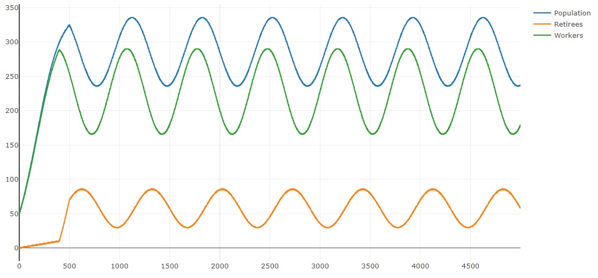

# Exercise 6 - Inflow and Outflow

This week's exercise is about the relation between prices on the stock market and the flow of investments. This exercise is about finding and verifying a good theory by analyzing a given data set. In order to make the inflow and outflow dynamics more interesting, we make the number of births of new agents follow a sine curve, leading to according curves in the total population as well. 

You can see that cycles of similar length show up in the stock prices.

## Data

Your task is to find out how inflows and outflows drive the stock prices observed on the stock market. All the data you need for this exercise can be downloaded from [the simulation server](http://meissereconomics.com/vis/simulation?sim=ex6-flow&metric=stockmarket) (follow the link and click the download button).

In classic models with instantaneous market clearing, prices are calculated by assuming that inflows and outflows are equal at each point in time:

${inflow}_t = {outflow}_t$

whereas ${inflow}_t$ is the amount invested into the stock market and ${outflow}_t = {price}_t * n_t$, with $n_t$ being the number of shares that are sold on day $t$. This also hold in our model when including the trades of the market makers in the inflow and outflow. However, we want to know how the inflow and outflow of the consumers impact the stock market. Thus, the flows given in the data exclude those of the market maker. Under these circumstances, the above equation no longer holds, which you can easily verify by observing that ${inflow}_t \neq {outflow}_t$ in the provided data on most days.

The log returns provided are simple the daily percentage changes. The advantage of using log returns is that you can simply add them up to get cummulative returns, whereas percentage returns need to be multiplied.

$\frac{p_t}{p_{t-2}} = \frac{p_t}{p_{t-1}} \frac{p_{t-1}}{p_{t-2}} = e^{ln \frac{p_t}{p_{t-1}} + ln \frac{p_{t-1}}{p_{t-2}}}$

Economists often use natural log returns by default and rarely ever convert back.

For the task at hand, you should **ignore all data before day 2000**. Also, you can ignore the data of the individual stocks and focus entirely on the index, which represents a weighted average of the two stocks. Volume represents the number of shares traded, but you can already get the full score without using volume data at all.

## Task

How do inflows and outflows impact prices? Can you come up with a testable hypothesis that describes this relation? It is clear that higher inflows will lead to higher prices, and higher outflows to lower prices, but how are they related exactly? In other words: given the price $p_{t-1}$, ${inflow}_t$ and ${outflow}_t$, can you come up with a rule to predict $p_t$?

To find and verify a good result, you will need to apply empirical methods using your [software of choice](https://www.uzh.ch/cmsssl/id/de/dl/sw/angebote/alle.html). To [do so in excel](http://www.excel-easy.com/examples/regression.html), you will need to install the [Analysis Toolpak add-in](http://www.excel-easy.com/data-analysis/analysis-toolpak.html).

Your rule should be simple, but also be statistically significant (t-stats above 10 are excellent, social scientists are usually already happy with a value of 2). It can help to reduce the noise by using a rolling average over multiple days instead of the data of individual days.

## Deliverables and deadline

Document your findings in the [lab journal](exercise06-journal.md), including an equation describing the relation between flows and prices, as well as the results of you statistic tests. No need to run the simulation yourself this time or to do any programming.

The deadline for submitting the lab journal to github is 2017-11-02 at 24:00.
