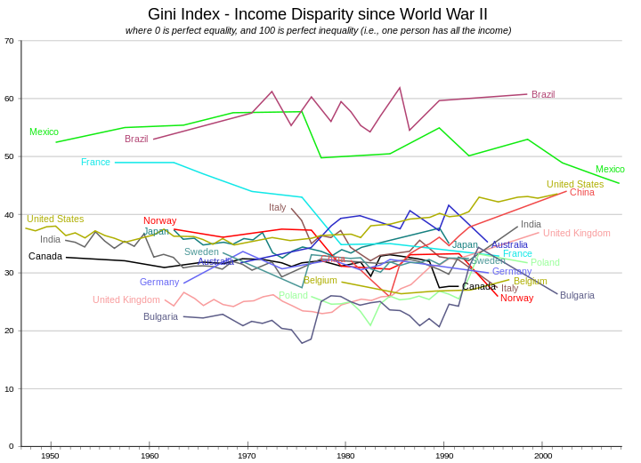

# Exercise 7 - Equality

One of the strength of agent-based models is their ability to allow for diversity. Instead of just having one representative consumer, we can have hundreds of individual consumers, that each have their own wealth, their own income, their own age, and even their own utility functions. This makes it straight-forward to measure equality, as well as other metrics that are based on variation within the population.

In this exercise, you will test the effect of varying demographics on equality, as measured by the [Gini coefficient](https://en.wikipedia.org/wiki/Gini_coefficient), which is the most common metrics to measure equality.

This exercise is based on the simulation from the previous exercise. One small change that was made is to reduce the number of man-hours the retirees consume every day to 12 in order to reduce the utility difference between workers and retirees somewhat. The [consumers](https://github.com/meisser/course/blob/ex7-equality-basic/simulation/src/com/agentecon/consumer/InvestingConsumer.java) are investing according to the optimal investment rule, assuming a daily interest rate of 0.5%. They pick the stocks with the highest dividend yields, but disregard yields when selling them.

## Task 1

Looking at the [equality statistics](http://meissereconomics.com/vis/simulation?sim=ex7-equality&metric=equality), you will notice that inequality is most of the time higher in the whole population than in each cohort individually! Can you explain why the observed inequality decreases when looking more "closely"? What causes the individual cohorts to have different inequality?

If you run the [LifeExpectancyConfiguration](../src/com/agentecon/exercise7/LifeExpectancyConfiguration.java) locally, it lets you output the wealth distribution at a specific day (note that this can take a while). Looking at that data might be helpful in explaining the observed differences between the cohorts.

## Task 2

What effect do you guess would an increasing life expectancy have on wealth inequality? To find this out, run the [SimulationServer](../../arena/src/com/agentecon/web/SimulationServer.java) locally with different values for life expectancy in the [LifeExpectancyConfiguration](../src/com/agentecon/exercise7/LifeExpectancyConfiguration.java).

## Deliverables and deadline

Document your findings in the [lab journal](exercise07-journal.md).

The deadline for submitting the lab journal to github is 2018-11-08 at 24:00.
