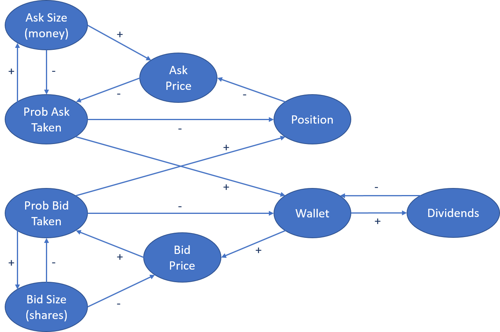

# Exercise 8 - Market Making

As discussed in the lecture, the market maker faces a non-trivial control problem. Its job is to provide liquidity to the market without going bankrupt. It has privileged access to the market, as the normal traders are not allowed to place limit orders, and thus always have to trade with a market maker. However, there might be multiple market makers competing with each other.

## Task

The above diagram shows the system dynamics of the current market making mechanism as implemented by the class [MarketMaking](../../Simulation/src/com/agentecon/finance/MarketMaking.java).

Your task is to identify and describe the feedback loop between "Position", "Ask price" and "Probability of the ask being taken", as well as to find three relations (arrows) in the diagram that are explicitly modeled in the [MarketMaking](../../Simulation/src/com/agentecon/finance/MarketMaking.java) class. Example:

* The negative relationship between "Position" and "Ask Price" can be deducted from looking at line 99 of the MarketMaking class, where the ask price is set to a value inversely proportional to the ask size, which is proportional to the size of the position.

## Deliverables and deadline

Document your findings in the [lab journal](exercise08-journal.md).

The deadline for submitting the lab journal to github is 2018-11-15 at 24:00.
